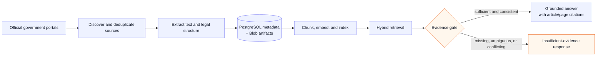
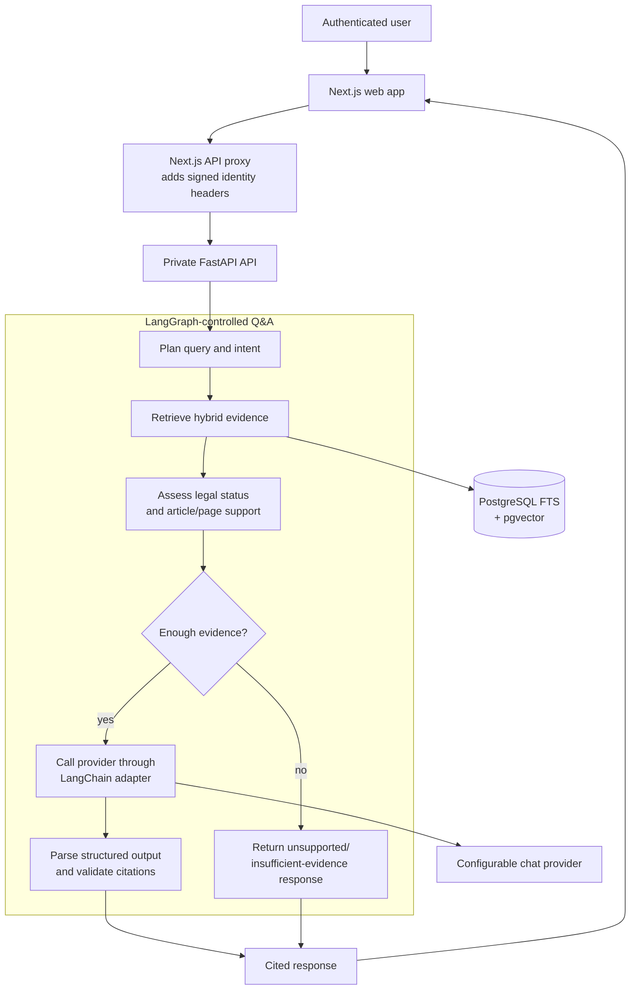
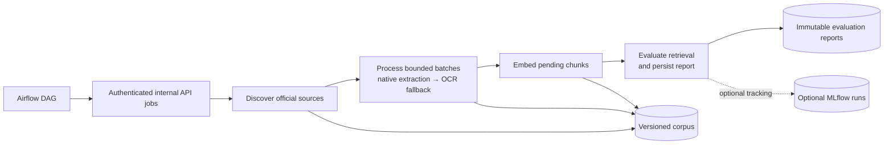
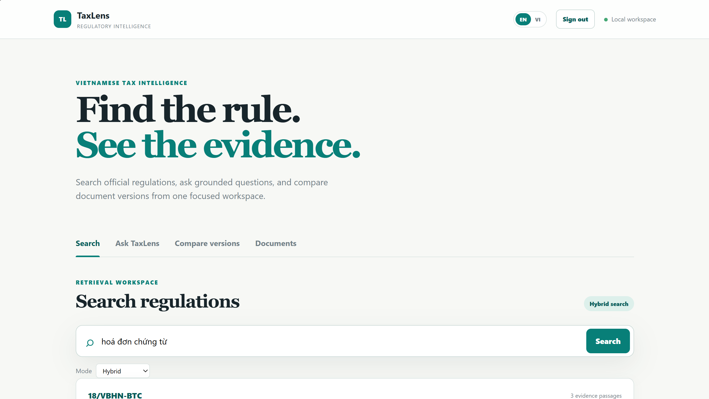
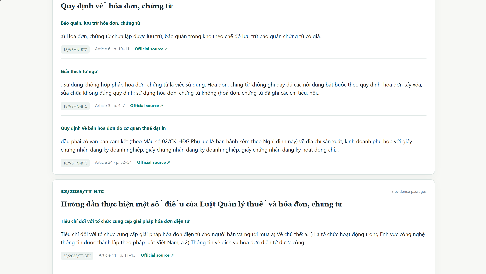
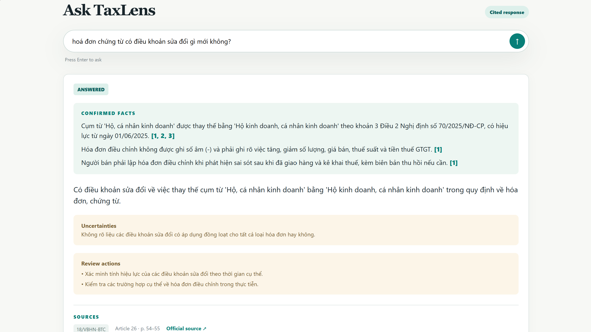

# TaxLens AI

**Cloud-native regulatory intelligence for Vietnamese tax professionals.**

TaxLens continuously discovers official Vietnamese tax documents, extracts and
indexes their contents, retrieves relevant provisions, and answers questions
with article-level citations that link back to the government source.

The repository contains an evidence-first RAG system with source ingestion,
document processing, retrieval, evaluation, security controls, and Azure
deployment using development-scale resources.

## Development deployment

The current development deployment is available at:

**Web application:**
`https://taxlens-dev-web.wonderfulfield-8256aab7.eastasia.azurecontainerapps.io`

The application includes authentication, hybrid regulation search, cited Q&A,
document browsing, and document comparison. The Airflow UI is deployed
separately and remains protected/paused unless a scheduled ingestion run is
intentionally enabled.

## System objectives

The system is designed to support the following operations:

- Which official document contains the applicable rule?
- Which article and page support the answer?
- Is the document current, superseded, or amended?
- What changed between two versions?
- Which source and provision support the answer?

TaxLens addresses those needs with source discovery, versioned legal metadata,
hybrid retrieval, grounded generation, citation validation, and scheduled
ingestion.

## Architecture: source ingestion to cited answer

The Q&A system uses a staged pipeline. Official documents are collected, stored,
processed, and indexed before they are available for retrieval:



Retrieval and generation are separate stages. The system stores document identity,
version metadata, source URLs, and processed passages before a model is called.
The evidence assessment stage checks the retrieved passages for legal status and
structural support such as article, clause, and page references. Generation runs
only when the evidence meets the configured checks. Otherwise, the API returns an
insufficient-evidence response. This separates retrieval quality from generation
and provides an explicit failure path for evaluation and debugging.

### Runtime request path

The web application, API, database, and Airflow have separate responsibilities.
Database credentials remain on the server side. Airflow invokes authenticated
internal API jobs; it does not write directly to application tables.



LangGraph defines the Q&A state machine: query planning, retrieval, evidence
assessment, routing, generation, and citation validation. LangChain is used at
the chat-provider adapter boundary. Provider configuration can therefore change
without changing the retrieval, legal metadata, or citation-validation modules.

### Ingestion, indexing, and evaluation loop

The daily workflow runs ingestion and evaluation outside the user request path.
It converts newly discovered government publications into searchable corpus
records and persists retrieval evaluation reports.



Airflow invokes allowlisted internal endpoints, and the API executes the same
idempotent job scripts used locally. Processing is bounded to fit cloud ingress
limits. Evaluation records corpus coverage separately from ranking quality, so a
missing document is reported as a coverage issue rather than a retrieval-ranking
failure.

### Component boundaries

| Boundary | Responsibility | Operational effect |
| --- | --- | --- |
| Ingestion → legal data | Discover official sources and preserve document/version identity | The corpus remains traceable and refreshable |
| Processing → retrieval | Extract, OCR, structure, chunk, and embed | Search operates on inspectable passages, not raw PDFs |
| Retrieval → generation | Assess consistency and structural support | The model cannot invent evidence that retrieval did not provide |
| Web → API | Proxy authenticated requests to a private service | Credentials and database access stay server-side |
| Airflow → API jobs | Orchestrate bounded, idempotent work | Scheduling is replaceable without duplicating domain logic |
| Evaluation → operations | Persist metrics, coverage, fingerprints, and history | A score can be reproduced and diagnosed |

## Engineering highlights

- **Hybrid legal retrieval:** PostgreSQL full-text search, pgvector semantic
  search, metadata filters, and lightweight score blending.
- **Grounded Q&A:** LangGraph controls retrieval, evidence validation,
  generation, citation validation, and safe fallback behavior.
- **Replaceable providers:** LangChain is used at the adapter boundary;
  Hugging Face model and routing policy are configuration-driven.
- **Vietnamese document processing:** native PDF extraction runs first, with
  Vietnamese/English Tesseract OCR for image-only or unusable PDFs.
- **Scheduled ingestion:** Airflow runs discovery, processing, OCR, embedding,
  and retrieval evaluation as idempotent tasks.
- **LLMOps workflow:** MLflow tracks evaluation runs and deterministic
  RAG-style metrics measure retrieval and answer behavior.
- **Security:** Auth.js credentials login, Argon2id password hashing,
  admin/user roles, private FastAPI ingress, Key Vault secrets, managed
  identity, and rate limiting for inference-backed Q&A.
- **Cloud delivery:** Terraform-managed Azure resources, remote Blob state,
  GitHub OIDC, immutable image tags, protected plans, and an approval gate before
  infrastructure changes are applied.

## Technology stack

| Area | Technology |
| --- | --- |
| Frontend | Next.js, TypeScript, Auth.js |
| API | FastAPI, Python 3.12, SQLAlchemy, Alembic |
| Retrieval | PostgreSQL full-text search, pgvector, reranking boundary |
| Embeddings | `intfloat/multilingual-e5-small`, CPU inference |
| Chat inference | Hugging Face Inference Providers, configurable routing |
| LLM workflow | LangGraph, LangChain adapter |
| Evaluation | MLflow, RAGAS-style deterministic metrics |
| Ingestion | Apache Airflow, idempotent API jobs |
| OCR | Tesseract with `vie` and `eng` language data |
| Cloud | Azure Container Apps, PostgreSQL Flexible Server, Blob Storage, Key Vault, ACR |
| Infrastructure | Terraform, GitHub Actions, Azure OIDC |

## Run locally

Prerequisites: Python 3.12 and Docker Desktop with Compose.

```powershell
Copy-Item .env.example .env
docker compose up -d postgres api web
docker compose exec -T api alembic upgrade head
docker compose exec -T api python scripts/seed.py
```

Open:

| Service | URL |
| --- | --- |
| Web app | `http://localhost:3000` |
| API docs | `http://localhost:8000/docs` |
| Airflow | `http://localhost:8080` |
| MLflow | `http://localhost:5000` |

Authentication is enabled locally. Configure the development values described
in `docs/authentication.md`, then sign in at `http://localhost:3000/login`.

Start optional LLMOps services when needed:

```powershell
docker compose --profile airflow --profile llmops up -d
```

The daily DAG is intentionally paused by default. Unpause and trigger
`tax_regulation_discovery_daily` only when you want to run discovery,
processing/OCR, embedding, and evaluation.

## Development checks

Run the same checks used by CI before pushing:

```powershell
python -m ruff check src tests scripts
python -m mypy src
python -m pytest
```

The current test suite covers authentication, protected routes, role-based
authorization, retrieval, citations, ingestion, document processing, and API
contracts.

## Deployment workflow

Azure deployment uses the following workflow:

1. `release-images.yml` builds and publishes API, web, and Airflow images under
   an immutable commit-SHA tag.
2. `deploy.yml` generates a Terraform plan using the remote Azure Blob state.
3. The protected deployment environment requires approval before applying the
   Terraform plan.

Production secrets are stored in GitHub Actions secrets and Azure Key Vault.
GitHub Actions authenticates to Azure with OIDC.

See:

- `docs/local-development.md` — local API, ingestion, and processing workflow
- `docs/authentication.md` — local authentication setup and security contract
- `docs/llmops-local.md` — LangGraph, MLflow, and evaluation workflow
- `docs/airflow-local.md` — local Airflow profile and DAG operations
- `docs/deployment.md` — Azure topology, smoke checks, and operations
- `docs/ci-cd.md` — GitHub Actions, OIDC, remote state, and approvals
- `IMPLEMENTATION_PLAN.md` — detailed development blueprint and milestone status
- `projectstructure.txt` — full system structure and design rationale

## Cost-conscious design

- The small multilingual embedding model is baked into the API image and runs
  on CPU, avoiding a managed embedding endpoint for every chunk.
- Native extraction runs before Tesseract, so OCR is used only when necessary.
- Hugging Face routing is configurable and defaults to the cheapest policy.
- PostgreSQL and pgvector consolidate relational, metadata, full-text, and
  vector storage into one managed database.
- Airflow and MLflow are separated from the request path and can be stopped or
  scaled down during development.
- Azure resources use small development SKUs and immutable image revisions.

## Scope and limitations

TaxLens is a development-stage regulatory information system. It is not a
substitute for professional legal or tax advice. Retrieval and evaluation
results depend on the documents currently indexed and the coverage of the
configured government sources. OCR accuracy depends on the quality, structure,
and legibility of scanned documents. The current deployment uses development-
scale infrastructure and configuration.

## Screenshots

### Search workspace





### Ask TaxLens


