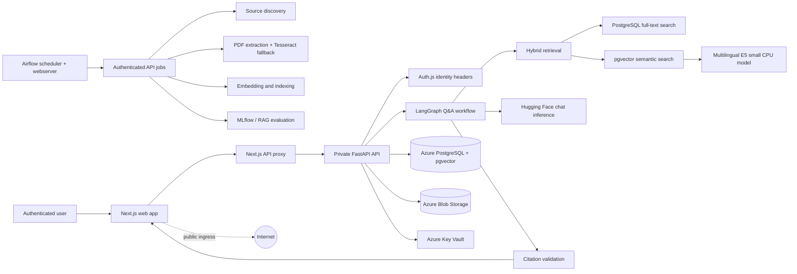

# TaxLens AI

**Cloud-native regulatory intelligence for Vietnamese tax professionals.**

TaxLens continuously discovers official Vietnamese tax documents, extracts and
indexes their contents, retrieves relevant provisions, and answers questions
with article-level citations that link back to the government source.

This is a portfolio project focused on practical AI platform engineering—not a
generic PDF chatbot. It demonstrates how to build, evaluate, secure, deploy,
and operate an evidence-first RAG system under a constrained budget.

## Live demo

The development deployment is available at:

**Web application:**
`https://taxlens-dev-web.wonderfulfield-8256aab7.eastasia.azurecontainerapps.io`

The application includes authentication, hybrid regulation search, cited Q&A,
document browsing, and document comparison. The Airflow UI is deployed
separately and remains protected/paused unless a scheduled ingestion run is
intentionally enabled.

## Why this project matters

Tax professionals need more than a keyword search box. They need to know:

- Which official document contains the applicable rule?
- Which article and page support the answer?
- Is the document current, superseded, or amended?
- What changed between two versions?
- What should be reviewed next?

TaxLens addresses those needs with source discovery, versioned legal metadata,
hybrid retrieval, grounded generation, citation validation, and scheduled
ingestion.

## Architecture



The web and API are separate services. FastAPI is private in Azure and is
reachable through the Next.js proxy. Airflow does not access application tables
directly; it calls a small authenticated internal job boundary.

## Engineering highlights

- **Hybrid legal retrieval:** PostgreSQL full-text search, pgvector semantic
  search, metadata filters, and lightweight score blending.
- **Grounded Q&A:** LangGraph controls retrieval, evidence validation,
  generation, citation validation, and safe fallback behavior.
- **Replaceable providers:** LangChain is used at the adapter boundary;
  Hugging Face model and routing policy are configuration-driven.
- **Vietnamese document processing:** native PDF extraction runs first, with
  Vietnamese/English Tesseract OCR for image-only or unusable PDFs.
- **Scheduled ingestion:** Airflow runs discovery, processing, OCR, embedding,
  and retrieval evaluation as idempotent tasks.
- **LLMOps workflow:** MLflow tracks evaluation runs and deterministic
  RAG-style metrics measure retrieval and answer behavior.
- **Security:** Auth.js credentials login, Argon2id password hashing,
  admin/user roles, private FastAPI ingress, Key Vault secrets, managed
  identity, and rate limiting for inference-backed Q&A.
- **Cloud delivery:** Terraform-managed Azure resources, remote Blob state,
  GitHub OIDC, immutable image tags, protected plans, and human-approved apply.

## Technology stack

| Area | Technology |
| --- | --- |
| Frontend | Next.js, TypeScript, Auth.js |
| API | FastAPI, Python 3.12, SQLAlchemy, Alembic |
| Retrieval | PostgreSQL full-text search, pgvector, reranking boundary |
| Embeddings | `intfloat/multilingual-e5-small`, CPU inference |
| Chat inference | Hugging Face Inference Providers, configurable routing |
| LLM workflow | LangGraph, LangChain adapter |
| Evaluation | MLflow, RAGAS-style deterministic metrics |
| Ingestion | Apache Airflow, idempotent API jobs |
| OCR | Tesseract with `vie` and `eng` language data |
| Cloud | Azure Container Apps, PostgreSQL Flexible Server, Blob Storage, Key Vault, ACR |
| Infrastructure | Terraform, GitHub Actions, Azure OIDC |

## Run locally

Prerequisites: Python 3.12 and Docker Desktop with Compose.

```powershell
Copy-Item .env.example .env
docker compose up -d postgres api web
docker compose exec -T api alembic upgrade head
docker compose exec -T api python scripts/seed.py
```

Open:

| Service | URL |
| --- | --- |
| Web app | `http://localhost:3000` |
| API docs | `http://localhost:8000/docs` |
| Airflow | `http://localhost:8080` |
| MLflow | `http://localhost:5000` |

Authentication is enabled locally. Configure the development values described
in `docs/authentication.md`, then sign in at `http://localhost:3000/login`.

Start optional LLMOps services when needed:

```powershell
docker compose --profile airflow --profile llmops up -d
```

The daily DAG is intentionally paused by default. Unpause and trigger
`tax_regulation_discovery_daily` only when you want to run discovery,
processing/OCR, embedding, and evaluation.

## Development checks

Run the same checks used by CI before pushing:

```powershell
python -m ruff check src tests scripts
python -m mypy src
python -m pytest
```

The current test suite covers authentication, protected routes, role-based
authorization, retrieval, citations, ingestion, document processing, and API
contracts.

## Deployment workflow

Azure deployment is intentionally controlled rather than automatic:

1. `release-images.yml` builds and publishes API, web, and Airflow images under
   an immutable commit-SHA tag.
2. `deploy.yml` generates a Terraform plan using the remote Azure Blob state.
3. A human reviews the plan.
4. The protected deployment environment applies the reviewed plan.

Production secrets remain in GitHub Actions secrets and Azure Key Vault. Azure
authentication uses GitHub OIDC rather than stored cloud passwords.

See:

- `docs/local-development.md` — local API, ingestion, and processing workflow
- `docs/authentication.md` — local authentication setup and security contract
- `docs/llmops-local.md` — LangGraph, MLflow, and evaluation workflow
- `docs/airflow-local.md` — local Airflow profile and DAG operations
- `docs/deployment.md` — Azure topology, smoke checks, and operations
- `docs/ci-cd.md` — GitHub Actions, OIDC, remote state, and approvals
- `IMPLEMENTATION_PLAN.md` — detailed development blueprint and milestone status
- `projectstructure.txt` — full system structure and design rationale

## Cost-conscious design

- The small multilingual embedding model is baked into the API image and runs
  on CPU, avoiding a managed embedding endpoint for every chunk.
- Native extraction runs before Tesseract, so OCR is used only when necessary.
- Hugging Face routing is configurable and defaults to the cheapest policy.
- PostgreSQL and pgvector consolidate relational, metadata, full-text, and
  vector storage into one managed database.
- Airflow and MLflow are separated from the request path and can be stopped or
  scaled down during development.
- Azure resources use small development SKUs and immutable image revisions.

## Portfolio scope and limitations

TaxLens is a working development deployment and resume project, not legal or
tax advice. The initial corpus is intentionally small and source coverage is
still curated. OCR quality varies with scanned document quality, and the
development deployment prioritizes a demonstrable architecture over production
scale.

## Screenshots

### Search workspace


### Ask TaxLens


